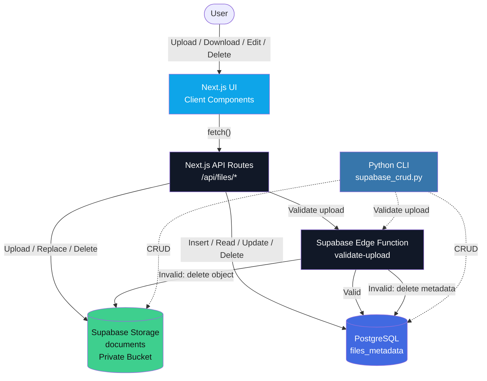
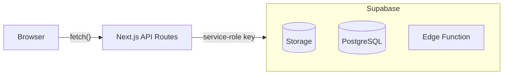
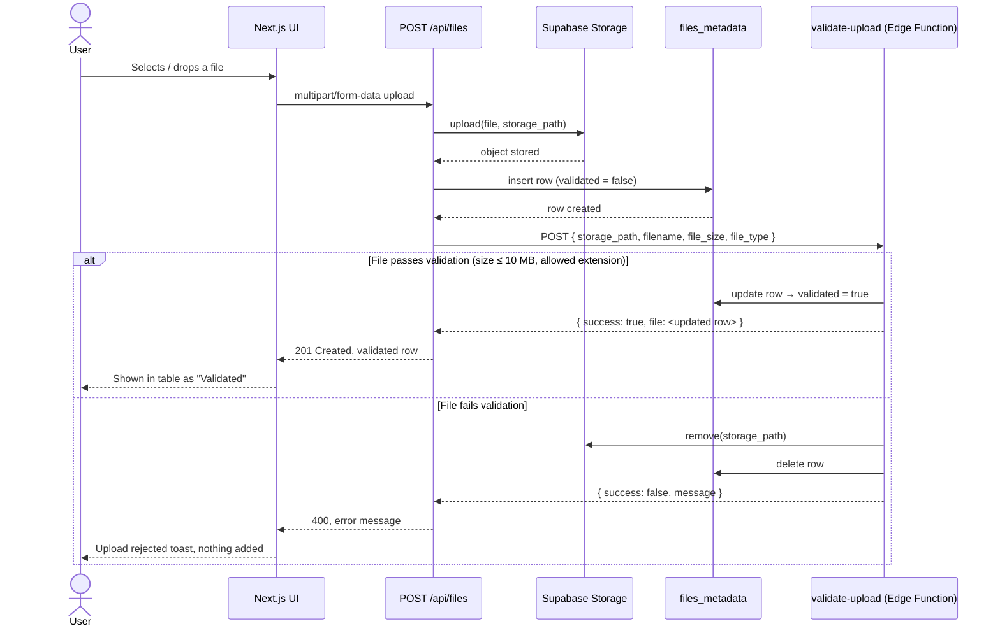
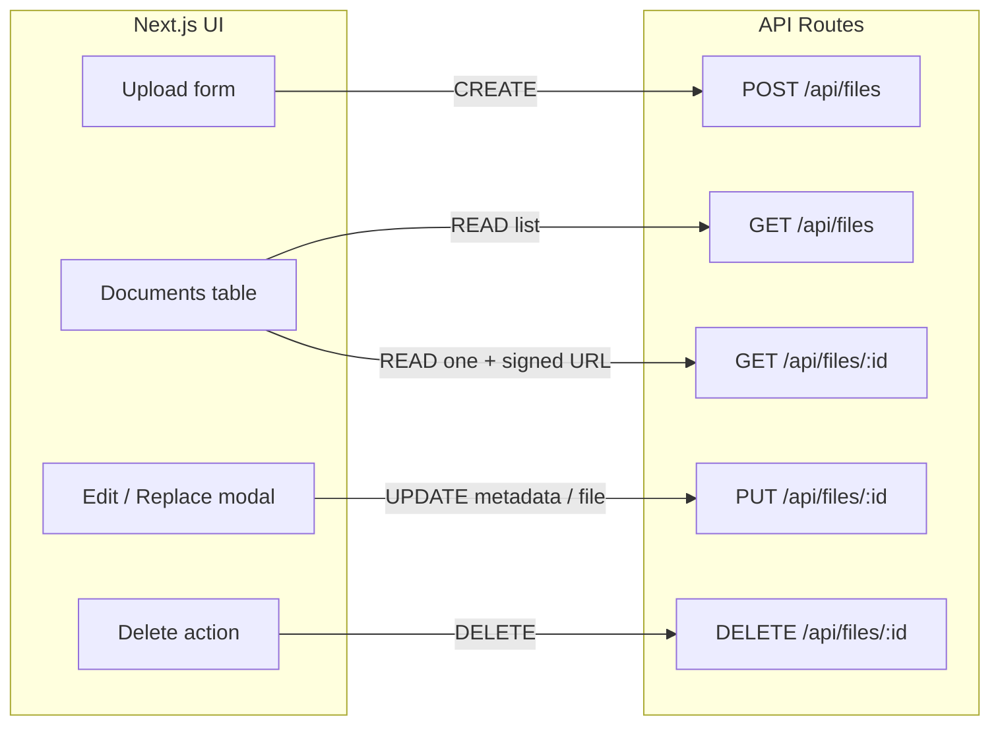

# DocVault — Supabase Storage + Database CRUD (Next.js + Python CLI)

A full-stack CRUD file manager. A Next.js 14 (App Router, TypeScript, Tailwind)
web app uploads files to a **private** Supabase Storage bucket (`documents`) and
records metadata in the Postgres table `files_metadata`. Uploads are validated by
a Supabase Edge Function before they are considered valid. A standalone Python
CLI (`python-cli/supabase_crud.py`) mirrors the same CRUD operations from the
terminal.

<p>
  
  
  
  
  
  
  
  
  
</p>

---

## Tech stack

| Technology | Purpose |
| --- | --- |
|  **Next.js 14+** | Frontend and API layer |
|  **React** | UI components and state |
|  **TypeScript** | Type-safe development |
|  **Tailwind CSS** | Responsive UI styling |
|  **@supabase/supabase-js** | Supabase client (browser + server) |
|  **Supabase Storage** | Private file storage |
|  **PostgreSQL** | File metadata database |
|  **Supabase Edge Functions** | Server-side upload validation |
|  **Deno** | Edge Function runtime |
|  **Python 3.11+** | Terminal CRUD application |
|  **supabase-py** | Python Supabase SDK |
|  **Vercel** | Next.js deployment |

---

## Architecture



### Security model

The browser **never** receives the Supabase service-role/secret key.



The service-role key is used **only** in server-side code and the Python CLI.

> **Important.** Never expose `SUPABASE_SERVICE_ROLE_KEY` (or any Supabase secret
> key) in client-side code, GitHub, `.env.example`, or public documentation.

---

## Upload flow



---

## CRUD operations



| Operation | Endpoint | Description |
| --- | --- | --- |
| Create | `POST /api/files` | Upload file + create metadata + validate |
| Read list | `GET /api/files` | List all files |
| Read one | `GET /api/files/:id` | Get metadata + signed download URL |
| Update | `PUT /api/files/:id` | Update metadata and/or replace file |
| Delete | `DELETE /api/files/:id` | Delete storage object + metadata |

**CREATE**

```
Client → POST /api/files → Upload object to documents bucket
       → Insert files_metadata row (validated = false)
       → Call validate-upload Edge Function
       → Valid?  Yes → validated = true
                 No  → delete Storage object + metadata row
```

**READ**

- `GET /api/files` returns the list of metadata records.
- `GET /api/files/:id` returns the file metadata plus a **signed download URL**
  (expires after **60 seconds**).

**UPDATE** — `PUT /api/files/:id` can update `filename`, `uploaded_by`, `notes`,
and/or a replacement file. If a replacement file is provided, it's uploaded to
the **same storage path** (`upsert: true`), the metadata is updated, and the
row is revalidated.

**DELETE** — `DELETE /api/files/:id` deletes the Storage object, then the
metadata row, and returns success. Partial failures are reported to the client.

---

## Project structure

```
DocVault/
├── app/
│   ├── api/
│   │   └── files/
│   │       ├── route.ts            GET list · POST create
│   │       └── [id]/
│   │           └── route.ts        GET read+signed URL · PUT update · DELETE
│   ├── page.tsx                    main UI (list, toasts, modal state)
│   ├── layout.tsx
│   └── globals.css
│
├── components/
│   ├── FileUploadForm.tsx          drag-and-drop upload
│   ├── FileTable.tsx               file list + per-row actions
│   ├── EditMetadataModal.tsx       edit metadata / replace file
│   └── ui/                         shadcn/Radix primitives
│       ├── badge.tsx
│       ├── button.tsx
│       ├── card.tsx
│       ├── dialog.tsx
│       ├── dropdown-menu.tsx
│       ├── input.tsx
│       ├── label.tsx
│       ├── progress.tsx
│       ├── skeleton.tsx
│       ├── table.tsx
│       ├── textarea.tsx
│       ├── toast.tsx
│       └── toaster.tsx
│
├── hooks/
│   └── use-toast.ts                toast state hook
│
├── lib/
│   ├── files.ts                    validation + storage-path helpers
│   ├── types.ts                    shared types
│   ├── utils.ts                    cn / formatBytes / formatDate
│   └── supabase/
│       ├── client.ts               browser client (anon key)
│       └── server.ts               server client (service role, server-only)
│
├── supabase/
│   ├── schema.sql                  table + RLS + bucket
│   ├── config.toml
│   └── functions/
│       ├── _shared/
│       │   └── cors.ts
│       └── validate-upload/
│           └── index.ts            Edge Function (Deno)
│
├── python-cli/
│   ├── supabase_crud.py            terminal CRUD
│   ├── requirements.txt
│   └── .env.example
│
├── .env.example
├── .env.local
├── .gitignore
├── package.json
├── tailwind.config.ts
├── tsconfig.json
├── next.config.mjs
├── vercel.json
└── README.md
```

---

##  Supabase project setup

1. Create a Supabase project from the [Supabase dashboard](https://supabase.com).
2. After creating the project, copy your **project reference ID**. For this
   project, the project reference has the following format:
   ```
   https://<project-ref>.supabase.co
   ```
3. Do not hard-code secrets into source files.

---

##  Database setup

Open **Supabase Dashboard → SQL Editor → New Query** and run the contents of
[`supabase/schema.sql`](supabase/schema.sql).

The schema creates:

- the `pgcrypto` extension (for `gen_random_uuid()`),
- the `files_metadata` table,
- an `updated_at` auto-update trigger,
- Row Level Security,
- a development RLS policy,
- the private `documents` Storage bucket.

Table structure:

| Column | Type | Description |
| --- | --- | --- |
| `id` | `uuid` | Primary key |
| `filename` | `text` | Original file name |
| `storage_path` | `text` | Storage object path |
| `file_type` | `text` | MIME type / extension |
| `file_size` | `bigint` | File size in bytes |
| `uploaded_by` | `text` | Optional uploader identifier |
| `uploaded_at` | `timestamptz` | Upload timestamp |
| `updated_at` | `timestamptz` | Last update timestamp |
| `validated` | `boolean` | Edge Function validation status |
| `notes` | `text` | Optional notes |

---

##  Row Level Security

RLS is enabled on `files_metadata`. For development, the project uses a
permissive policy:

```sql
using (true)
with check (true)
```

This is intentionally convenient for development/testing.

> **Production warning.** The permissive policy should **not** be used for a
> production application with real users. Before going to production:
> - Use Supabase Authentication.
> - Add a user identifier such as `user_id uuid references auth.users(id)`.
> - Restrict rows using `auth.uid()`.
> - Add Storage policies based on authenticated users.
> - Do not allow unrestricted anonymous access.
>
> Example production-style policy:
> ```sql
> using (auth.uid() = user_id)
> with check (auth.uid() = user_id)
> ```
> The exact production policy should be designed according to the
> application's authentication model.

---

##  Storage setup

- Bucket: `documents`
- Public: **OFF** — the bucket must remain private.

Files are accessed using **signed URLs**, never public URLs. In Supabase:
**Storage → Buckets → documents → Public = OFF**.

The SQL schema creates the bucket automatically:

```sql
insert into storage.buckets (id, name, public)
values ('documents', 'documents', false)
on conflict (id) do nothing;
```

---

## Allowed file types

- Maximum upload size: **10 MB**
- Allowed extensions: `pdf`, `png`, `jpg`, `jpeg`, `txt`, `docx`
- Expected MIME types include: `application/pdf`, `image/png`, `image/jpeg`,
  `text/plain`, `application/vnd.openxmlformats-officedocument.wordprocessingml.document`

The application validates the file **on the server**, and again through the
**Edge Function**. Client-side validation is only for user experience —
server-side validation is required for security.

---

##  Supabase database permissions

The Edge Function uses the `service_role` database role. If the Edge Function
reports:

```
permission denied for table files_metadata
```

grant the required permissions in the Supabase SQL Editor:

```sql
GRANT SELECT, INSERT, UPDATE, DELETE
ON TABLE public.files_metadata
TO service_role;
```

---

##  Supabase Edge Function: `validate-upload`

Source: [`supabase/functions/validate-upload/index.ts`](supabase/functions/validate-upload/index.ts)

The function accepts:

```json
{
  "storage_path": "example/report.pdf",
  "filename": "report.pdf",
  "file_size": 204800,
  "file_type": "application/pdf"
}
```

It:

1. Validates the file size.
2. Validates the file type/extension.
3. Finds the metadata row.
4. Marks valid uploads as `validated = true`, `notes = "Validated by edge function"`.
5. Deletes invalid Storage objects **and** invalid metadata rows.
6. Returns JSON.

**Example success response:**

```json
{ "success": true, "message": "File validated successfully.", "file": {} }
```

**Example failure response:**

```json
{ "success": false, "message": "Validation failed: ..." }
```

---

## Edge Function configuration

`supabase/config.toml` should contain:

```toml
project_id = "<your-project-ref>"

[functions.validate-upload]
verify_jwt = false
```

The function endpoint is protected by the server-side application
architecture and should not be exposed as a general public file-management
API — the Next.js server calls the function from server-side code.

If you later introduce authenticated users, consider enabling JWT
verification and passing authenticated user tokens according to your
security model.

---

## Deploy the Edge Function

Install the Supabase CLI if necessary:

```bash
npm install -g supabase
supabase --version
```

Login and link the project:

```bash
supabase login
supabase link --project-ref <your-project-ref>
```

Deploy:

```bash
supabase functions deploy validate-upload
```

Check deployed functions:

```bash
supabase functions list
```

Expected result: `validate-upload | ACTIVE`.

> **Note.** Supabase CLI versions can differ in available commands. Some CLI
> versions do not provide `supabase functions invoke`. If that command isn't
> available for you, use the HTTP/PowerShell/curl test below instead.

---

##  Testing the Edge Function

For a successful test, the `storage_path` must point to an **existing** object
in the `documents` bucket, with an **existing** corresponding row in
`files_metadata` — the Edge Function updates that existing row, it doesn't
create one.

**PowerShell test** — bash's `\` line continuation doesn't work in
PowerShell; use a backtick `` ` `` if you want to split lines, or keep it on
one line:

```powershell
$body = @{
    storage_path = "<existing-storage-path>"
    filename     = "report.pdf"
    file_size    = 204800
    file_type    = "application/pdf"
} | ConvertTo-Json

$params = @{
    Uri     = "https://<project-ref>.functions.supabase.co/validate-upload"
    Method  = "POST"
    Headers = @{
        Authorization  = "Bearer <server-key>"
        apikey         = "<server-key>"
        "Content-Type" = "application/json"
    }
    Body = $body
}

Invoke-RestMethod @params
```

Do not put your real secret key into source control.

**curl test:**

```bash
curl -X POST "https://<project-ref>.functions.supabase.co/validate-upload" \
  -H "Authorization: Bearer <server-key>" \
  -H "apikey: <server-key>" \
  -H "Content-Type: application/json" \
  -d '{"storage_path":"<existing-storage-path>","filename":"report.pdf","file_size":204800,"file_type":"application/pdf"}'
```

**Invalid upload test** — should be rejected and rolled back:

```json
{
  "storage_path": "<existing-invalid-storage-path>",
  "filename": "malware.exe",
  "file_size": 204800,
  "file_type": "application/x-msdownload"
}
```

The Edge Function should reject the file and roll back the Storage object and
metadata row.

---

## Edge Function troubleshooting

| Symptom | Fix |
| --- | --- |
| `401 Unauthorized` | Check `supabase/config.toml` has `[functions.validate-upload]` → `verify_jwt = false`, then redeploy: `supabase functions deploy validate-upload` |
| `permission denied for table files_metadata` | Run the `GRANT` statement from #-supabase-database-permissions |
| `Cannot coerce the result to a single JSON object` | The function didn't find a corresponding `files_metadata` row while using `.single()` — a standalone validation request against a nonexistent `storage_path` isn't a valid test; the metadata row must already exist from a real upload |
| `supabase functions invoke` not available | Some CLI versions don't ship it — use the PowerShell/curl HTTP test in [section 10](#10-testing-the-edge-function) instead |

---

##  Environment variables

Create `.env.local` in the project root:

```
NEXT_PUBLIC_SUPABASE_URL=https://<project-ref>.supabase.co
NEXT_PUBLIC_SUPABASE_ANON_KEY=<your-anon-or-publishable-key>

SUPABASE_SERVICE_ROLE_KEY=<your-service-role-secret>

SUPABASE_EDGE_FUNCTION_URL=https://<project-ref>.functions.supabase.co/validate-upload
```

| Variable | Purpose | Exposure |
| --- | --- | --- |
| `NEXT_PUBLIC_SUPABASE_URL` | Supabase project URL | Browser-safe |
| `NEXT_PUBLIC_SUPABASE_ANON_KEY` | Public/anon client key | Browser-safe |
| `SUPABASE_SERVICE_ROLE_KEY` | Server-side database/storage access | Server only |
| `SUPABASE_EDGE_FUNCTION_URL` | Edge Function endpoint | Server only |

> **Important.** Never expose `SUPABASE_SERVICE_ROLE_KEY` to Client
> Components. Never put it in a `NEXT_PUBLIC_*` variable. Never commit it to
> GitHub.

---

##  Supabase client setup

The application has two Supabase clients:

- **Browser client** — [`lib/supabase/client.ts`](lib/supabase/client.ts) —
  uses `NEXT_PUBLIC_SUPABASE_URL` and `NEXT_PUBLIC_SUPABASE_ANON_KEY`. Safe
  for browser-side use.
- **Server client** — [`lib/supabase/server.ts`](lib/supabase/server.ts) —
  uses the server-side service-role key. Must **never** be imported into a
  Client Component; it imports `server-only` so the bundler errors if it ever
  leaks into client code.

---

## 14. Next.js application setup

```bash
npm install
# if @supabase/supabase-js isn't already installed:
npm install @supabase/supabase-js

npm run dev
```

Open http://localhost:3000. Make sure `.env.local` is populated first.

---

## Next.js API routes

**`app/api/files/route.ts`**

- `GET` — lists all records from `files_metadata`.
- `POST` — accepts `multipart/form-data`. Receives the uploaded file, checks
  it, creates a storage path, uploads to `documents`, inserts metadata, calls
  `validate-upload`, returns the final metadata row, and rolls back if
  validation fails.

**`app/api/files/[id]/route.ts`**

- `GET` — gets one file and generates a signed URL (60-second expiration).
- `PUT` — can update metadata only, a replacement file only, or both.
  Replacement files use the same Storage path.
- `DELETE` — deletes the Storage object and the metadata row; handles partial
  failure and returns an appropriate error response.

---

## Web UI

Main interface: [`app/page.tsx`](app/page.tsx). Components:

- [`components/FileUploadForm.tsx`](components/FileUploadForm.tsx) — drag and
  drop, file browser, client + server validation, upload progress, success
  and error messaging.
- [`components/FileTable.tsx`](components/FileTable.tsx) — filename, file
  size, file type, upload date, updated date, validation status, and
  per-row actions (Download, Replace, Edit metadata, Delete).
- [`components/EditMetadataModal.tsx`](components/EditMetadataModal.tsx) —
  edit metadata and/or replace the underlying file.
- [`components/ui/`](components/ui) — the shadcn/Radix primitive components
  (`button`, `card`, `dialog`, `dropdown-menu`, `input`, `label`, `progress`,
  `table`, `toast`, etc.) that the app above is built from.
- [`hooks/use-toast.ts`](hooks/use-toast.ts) — the toast notification hook
  used throughout the UI.

---

##  Python terminal CRUD application

The standalone Python CLI is located at
[`python-cli/supabase_crud.py`](python-cli/supabase_crud.py).

Requirements: **Python 3.11+**, `supabase-py`, `requests`, `python-dotenv`.

---

##  Python environment — Conda

```bash
conda create -n supabase-crud python=3.11
conda activate supabase-crud

cd python-cli
pip install -r requirements.txt
pip show supabase   # verify the Supabase Python package
```

---

##  Python environment — venv alternative

```bash
python -m venv .venv
# Windows:      .venv\Scripts\activate
# macOS/Linux:  source .venv/bin/activate

pip install -r requirements.txt
```

Use either Conda or venv — not both, unless you have a specific reason to.

---

## 20. Python CLI environment variables

Create `python-cli/.env`:

```
SUPABASE_URL=https://<project-ref>.supabase.co
SUPABASE_SERVICE_ROLE_KEY=<your-service-role-secret>
SUPABASE_EDGE_FUNCTION_URL=https://<project-ref>.functions.supabase.co/validate-upload
```

Do not commit this file. The Python CLI uses the service-role key for its
server-side CRUD operations.

---

##  Python CLI commands

```bash
python supabase_crud.py --help

# Upload
python supabase_crud.py upload ./report.pdf --uploaded-by team@acme.com --notes "Q3 report"

# List
python supabase_crud.py list

# Download
python supabase_crud.py download <file-id> --output ./downloaded/

# Update metadata
python supabase_crud.py update <file-id> --notes "Reviewed"

# Replace file
python supabase_crud.py update <file-id> --replace-file ./new-report.pdf --revalidate

# Delete
python supabase_crud.py delete <file-id>
```

---

##  Python CLI CRUD flow

```
upload  → Storage → files_metadata → validate-upload
download → file ID → metadata lookup → signed URL → download
update  → file ID → metadata and/or replacement file → Storage update
        → metadata update → optional revalidation
delete  → file ID → delete Storage object → delete metadata
```

The Python application mirrors the web application end to end.

---
##  API reference

**`GET /api/files`** — returns all files.

**`POST /api/files`** — uploads a new file. Content type: `multipart/form-data`,
form field `file=<uploaded-file>`. The server handles the Storage upload,
metadata insertion, and Edge Function validation.

**`GET /api/files/:id`** — returns one file: metadata plus a signed download
URL (expires after 60 seconds).

**`PUT /api/files/:id`** — updates metadata and/or replaces the file.

**`DELETE /api/files/:id`** — deletes the file and its metadata.

---

##  Error handling

The application returns meaningful errors for: missing file, unsupported file
type, file larger than 10 MB, Storage upload failure, database insertion
failure, Edge Function failure, file not found, signed URL generation
failure, Storage deletion failure, and metadata deletion failure. The UI
surfaces these through toast/notification messages.

---

##  Deployment to Vercel

**Step 1 — push to GitHub**

```bash
git add .
git commit -m "Build DocVault CRUD application"
git push
```

Before pushing, verify that `.env.local` and `python-cli/.env` are ignored.

**Step 2 — create Vercel project**

Vercel → **Add New → Project → Import Git Repository** → select the DocVault
repository. Vercel should auto-detect Next.js.

**Step 3 — add environment variables**

Project → Settings → Environment Variables → add `NEXT_PUBLIC_SUPABASE_URL`,
`NEXT_PUBLIC_SUPABASE_ANON_KEY`, `SUPABASE_SERVICE_ROLE_KEY`, and
`SUPABASE_EDGE_FUNCTION_URL` with real values, for **Production**, **Preview**,
and **Development**.

**Step 4 — deploy**

Click **Deploy**. Vercel runs the Next.js build and deploys the application.

---

## Troubleshooting

| Symptom | Fix |
| --- | --- |
| `supabase` command not recognized | `npm install -g supabase` |
| Docker error on `supabase status` | Not required for deploying to a hosted project — use `supabase link` + `supabase functions deploy` instead |
| `supabase functions invoke` unavailable | Use the curl/PowerShell test above |
| Edge Function `401` | Set `verify_jwt = false`, redeploy |
| Edge Function permission error | Run the `GRANT` statement |
| Edge Function says no metadata row exists | Test with a real uploaded file's `storage_path`, not an arbitrary one |
| Next.js can't read env vars | Confirm `.env.local` is next to `package.json`, restart `npm run dev` |
---

##  Development checklist

**Supabase**
- [ ] Supabase project created
- [ ] `schema.sql` executed
- [ ] `files_metadata` exists
- [ ] RLS enabled
- [ ] `documents` bucket exists and is private
- [ ] Storage MIME types configured
- [ ] Service-role permissions verified

**Edge Function**
- [ ] `validate-upload` created
- [ ] `config.toml` configured
- [ ] Function deployed and shows `ACTIVE`
- [ ] Environment variables available
- [ ] Validation tested

**Next.js**
- [ ] Dependencies installed
- [ ] `.env.local` configured
- [ ] Supabase clients created
- [ ] API routes implemented
- [ ] Upload UI implemented
- [ ] File table implemented
- [ ] Edit modal implemented
- [ ] Download / Replace / Delete all work

**Python**
- [ ] Python 3.11+ installed
- [ ] `supabase-crud` environment created
- [ ] `requirements.txt` installed
- [ ] Python `.env` configured
- [ ] Upload / List / Download / Update / Delete all work

**Deployment**
- [ ] Git repository created
- [ ] Secrets excluded from Git
- [ ] Vercel project created
- [ ] Vercel environment variables added
- [ ] Production deployment successful
- [ ] Production upload tested

---

